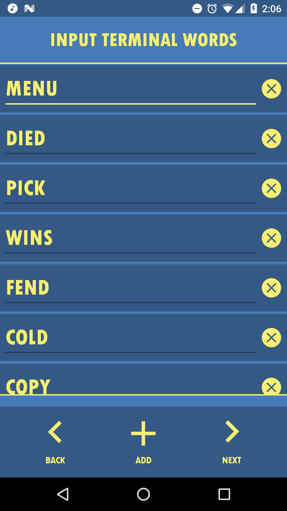
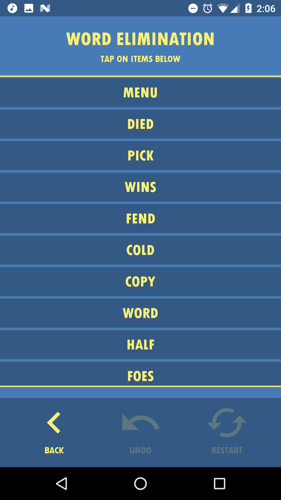
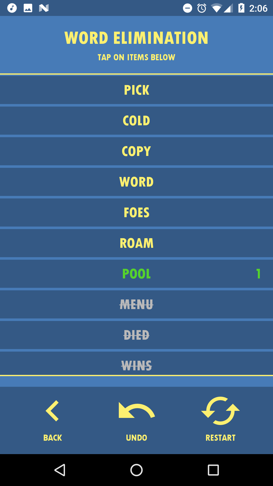

# Fallout-4-Terminal-Solver

## About
The Fallout 4 Terminal Solver Android app helps players of the game [Fallout 4](https://en.wikipedia.org/wiki/Fallout_4) solve ('Hack')
[Terminals](http://fallout.wikia.com/wiki/Terminal). Terminals are essential to finding loot, unlocking new areas, and leveling up your character. Below are a few screen shots of the app solving a Terminal.

### Input Screen:


### Elimination Screen:


### After Applying a Filter:



## How Does Terminal Hacking Work?
A typical locked Terminal in fallout 4 will look something like this:


The player is presented with a screen filled with random characters, and in bewteen the random characters there are selectable words. 
Exactly one of these words is the password to the terminal, and as the player your job is the find the password with the given
amount of attempts (indicated at the top of the screen). 

As the player when you select a word one of three things will happen:
* You guessed the correct password, and the terminal becomes unlocked.
* You've ran out of attempts, and the terminal locks itself. The player must try again later, with a new set of words.
* You've guessed the incorrect word, however the terminal gives you something called a "Likeness".

### Likeness
After the player has guessed an incorrect word, a likeness number is given to the player. The number indicates the number of
characters in the word guessed that are in the same position (location) as the terminal's password. 
For example, a likeness of 0 means that **no characters** of the word just guessed are in the same location as the password.

Here are a few more examples. Assume the terminal password is **GUESS**

```
Guessed Word: GHOST - Likeness = 2 - Both 'G' & first 'S' are in same location
```
```
Guessed Word: GUESS - Likeness = 5 - All letters are in same location
```
```
Guessed Word: SSEUG - Likeness = 1 - Only 'E' is in same location
```

From this information, the terminal password can be narrowed down.

## How Does the App Help?
The Android app eliminates words based on the given likeness of a word, so that players do not have to keep track of this in their head.
By eliminating a large number of words at a time, the app helps narrow down the terminal password in just a few guesses. Different difficulties have words with longer lengths, making it harder to figure out which words to keep and eliminate without help.
The application also supports undo and restart actions.

## How the Elimination Algorithm works
The complete algorithm has been packaged into a class, and can be used in any Java based application. You can find the source for it [here](app/src/main/java/com/zainhumayun/fallout4terminalsolver/TerminalSolver.java). The solver assumes that each word in the list is the same size (as is in the Fallout 4 game), and are the came case (uppercase vs lowercase). 

A list of words left is kept, along with a history stack containing a filter, and the words it has eliminated. The history stack is used to undo guess attempts. Every time a filter is applied, the solver looks through the remaining words left, finds the likeness number in bewteen the filter and the word, and eliminates it if the likeness does not match the given likeness from the Terminal. This is done until one word is left (meaning the solver has found the word) or when there are no words left (meaning the solver could not find a solution due to various reasons).

A few reasons for not being able to find a solution could be:
* The entered likeness number for one or more filters was incorrect.
* The words in the list were not all capitalized (like in the game). The solver is case sensitive.
* One or more words in the given list had a different length than the other words.
